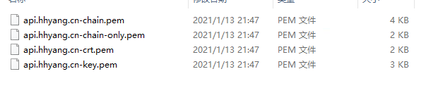

## 准备工作
* windows 版本的 nginx 一个 [下载地址](http://nginx.org/en/download.html)
* 域名已经解析的对应服务器 windows server
* windows server 已经安装 `IIS` [安装方式]((https://www.cnblogs.com/yanglang/p/11056924.html))

### 安装软件

##### (一) 下载软件、如果有条件也可以给作者点个start哦
```sh
https://github.com/win-acme/win-acme/releases
```
##### (二)  按自己的机型下载对应的包，下面是我选择的版本包。等待下载完成。。。


##### (三)  下载完成后解压到本地，我们可以看到这样的目录，到此我们的安装软件已经完成


### 开始获取

##### (一) 我们点开 `wacs.exe` 你会看下如下的界面，英文不懂没关系，可翻译可跟着我来。


> 说明一下，因为我本地已经有一个证书了，所有 `A` 选项是可用的。 这一步我们选择 `M` 使用完整的选项创建证书。

##### (二) 我们输入完 `M` 后会提示你选择怎么读取需要包含证书的域名，我们选择 `2` 然后输入域名。


##### (三) 确认域名是否正确，你也可以重新输入，我们直接回车。


##### (四) 然后让我们选择如何校验文件方式，这时我们选 `1`。


##### (五) 输入校验根路径，我们直接输入nginx的html路径，然后按下回车。接着他让我们选择是否在验证前copy默认的web配置，我们输入 `y`。


##### (六) 选择证书需要应用那种私钥，我们直接输入 `2`。


##### (七) 接着就是选择如何保存证书啦，我们输入 `2`，再输入保存秘钥的路径回车即可。


##### (八) 接下来都直接输入回车默认选项即可。


### 关于nignx 配置

```nginx
worker_processes  1;

events {
    worker_connections  1024;
}

http {
    include       mime.types;
    default_type  application/octet-stream;
	server_names_hash_bucket_size 64;

    sendfile        on;

	server {
        listen       443 ssl; 
        server_name  api.hhyang.cn;   
        ssl_certificate      C:\myKey\api.hhyang.cn-crt.pem;
        ssl_certificate_key  C:\myKey\api.hhyang.cn-key.pem;

        ssl_session_cache    shared:SSL:1m;
        ssl_session_timeout  5m;

        ssl_ciphers  HIGH:!aNULL:!MD5;
        ssl_prefer_server_ciphers  on;

        location  / {
            proxy_pass   http://8.135.98.74:8089/;	  
            index index.html index.php;		
            proxy_set_header X-Real-IP $remote_addr;
            proxy_set_header X-Real-Port $remote_port;
            proxy_set_header X-Forwarded-For $remote_addr;	
        }
    }
}
```

### 最终生成的秘钥

