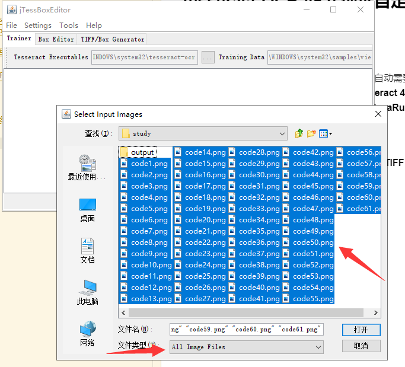
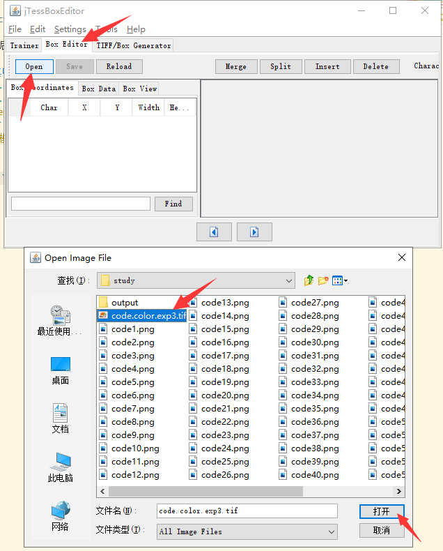
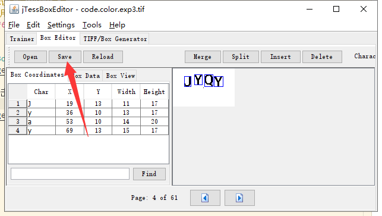
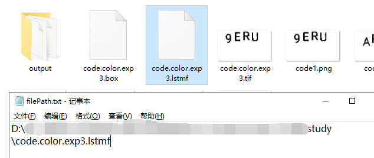
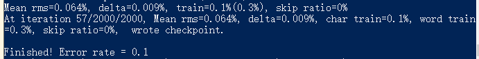
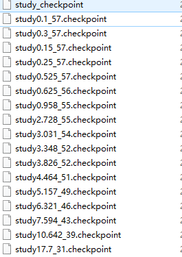

## Tesseract-OCR-v5.0 训练自定义字库


### 准备工具
* [Tesseract-OCR-v5.0.0](https://digi.bib.uni-mannheim.de/tesseract/)
* [tessdata_best](https://github.com/tesseract-ocr/tessdata_best) 官方（最准确）培训模型，自动需要用到语言下那个语言包。
* [tessdata](https://github.com/tesseract-ocr/tessdata) 这些语言数据文件仅适用于 **Tesseract 4.0.0**
* [jTessBoxEditor](https://sourceforge.net/projects/vietocr/files/jTessBoxEditor/) 使用此工具请注意要安装 **JavaRuntime**

### 操作开始
1. **打开 `jTessBoxEditor`，选择 `Tools->Merge TIFF`，进入训练样本所在文件夹，选中要参与训练的样本图片：**


2. **点击 `打开` 后弹出保存对话框，选择保存在当前路径下，文件命名为 `code.color.exp3.tif` ，格式只有一种 `TIFF` 可选。 这里名字随便，喜欢用啥就用啥，下面有命名规范！**
* **tif** 文面命名格式 `[lang].[fontname].exp[num].tif`
* **lang** 是语言，**fontname** 是字体，**num**为自定义数字。

3. **在训练目录下打开cmd，用现有的字体库识别.tif文件，生成对应的.box文件**
```sh
tesseract code.color.exp3.tif code.color.exp3 -l eng --psm 6 batch.nochop makebox
```
输入命令后，会生成 **code.color.exp3.box** 文件。

##### 其中命令参数含义： 
* `code.color.exp3.tif` 上一步生成的 `.tif` 格式的文件
* `code.color.exp3` 指明要生成的 `.box` 文件的名称
* `-l` eng 表示识别使用的语言是 eng，
* `–psm` 表示采用的识别模式，通常 **6** 比较好。可通过 `tesseract --help-psm` 查看所有的识别模式。**6** 指的是假设去识别一个单一的文本块。


4. **使用 `jTessBoxEditor` 矫正 `.box` 文件的错误**


打开后矫正后，点击 **save**



5. **利用 `.tif` 和 `.box` 文件，生成 `.lstmf` 文件用于 `lstm` 训练**
```sh
tesseract code.color.exp3.tif code.color.exp3 -l eng --psm 6 lstm.train
```
输入命令后，会生成 **code.color.exp3.lstmf** 和 **code.color.exp3.txt**（不用管，删除就好） 文件。
##### 其中命令参数含义： 
* `code.color.exp3.tif` 上一步生成的 `.tif` 格式的文件
* `code.color.exp3` 指明要生成的 `.lstmf` 文件的名称
* `-l` eng 表示识别使用的语言是 eng，
* `–psm` 表示采用的识别模式，通常 **6** 比较好。可通过 `tesseract --help-psm` 查看所有的识别模式。**6** 指的是假设去识别一个单一的文本块。

6. **用已有的或官方下载的 `.traineddata` 文件中提取 `.lstm` 文件**
注：一定要用从 【[tessdata_best](https://github.com/tesseract-ocr/tessdata_best)】 链接中下载的`.traineddata`文件，其他的 `.traineddata` 文件中提取`.lstm`文件无法进行训练。
将下载好的`.traineddata`文件拷贝到训练文件夹下，从`.traineddata`文件中提取出`eng.lstm` 文件
```sh
combine_tessdata -e eng.traineddata eng.lstm
```
输入命令后，会生成 **eng.lstm** 文件。

7. **创建文件，里边的内容为`.lstmf`文件的路径地址。**


8. **进行训练**
```sh
lstmtraining 
--debug_interval -1 --max_iterations 2000
--model_output="D:\ocrTest\study\output\study"
--continue_from="D:\ocrTest\study\eng.lstm" 
--train_listfile="D:\ocrTest\study\filePath.txt" 
--traineddata="D:\ocrTest\study\eng.traineddata" 
```
##### 其中命令参数含义： 
* `–max_iterations` 指明训练遍历次数。最好使用这个参数：**–target_error_rate 0.01 训练至错误率低于0.01**
* `--debug_interval` 当值为`-1`时，训练结束，会显示训练的一些结果参数。
* `--model_output` **模型训练输出的路径**，存放训练阶段文件和最终的字库
* `--continue_from` **训练从哪里开始**，这里指定从第6步中提取的 `eng.lstm` 文件。也可从之前训练生成的阶段文件
* `--train_listfile` 指定上一步创建的`filePath.txt`文件路径
* `--traineddata` 下载的`.traineddata`文件的路径

训练结束后，在`output`文件夹中会生成一个 **study_checkpoint** 文件和多个类似 **study0.1_57.checkpoint**的`.checkpoint`文件



9. **将`checkpoint`文件和`.traineddata`文件合并成新的`.traineddata`文件**
```sh
lstmtraining 
--stop_training 
--continue_from="D:\ocrTest\study\output\study_checkpoint" 
--traineddata="D:\ocrTest\study\eng.traineddata" 
--model_output="D:\ocrTest\study\output\code.traineddata"
```
##### 其中命令参数含义： 
* `--stop_training ` 默认要有
* `--continue_from ` 上一步生成的`output_checkpoint`文件路径。
* `--traineddata` 下载的`.traineddata`文件的路径
* `--model_output` `code.traineddata` 输出的路径


10. 将新生成的`code.traineddata`文件拷贝到`tessdata`文件夹下，通过代码进行识别，完结。

#### 另外一种方式【[参考这里](https://blog.csdn.net/limingblogs/article/details/104062955)】